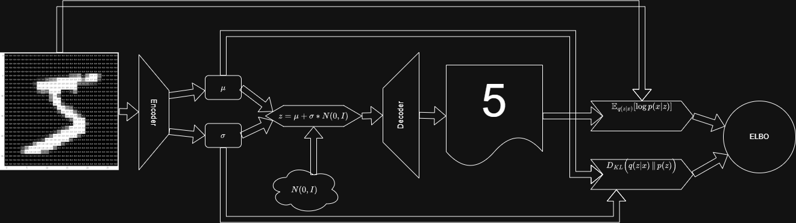
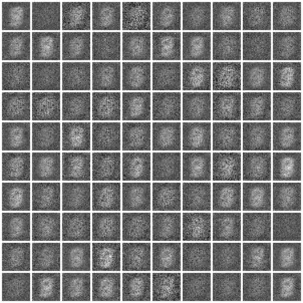
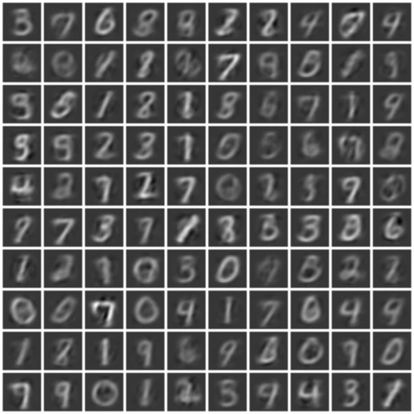

# VAE

This is a simple VAE project on MNIST data.  
VAE architecture is one of the most common interview topics at many ML/DL/CV companies, so it's absolutely something you must know. The main part of the VAE you should understand clearly is **ELBO** — the **E**xpectation of the **L**ower **BO**und for the data likelihood.

---

<td align="center">
  
</td>

---
## Epoch 0 → Epoch 90

<table>
  <tr>
    <td align="center"><b>Epoch 0 (Before)</b></td>
    <td align="center"></td>
    <td align="center"><b>Epoch 90 (After)</b></td>
  </tr>
  <tr>
    <td align="center">
      
    </td>
    <td align="center" valign="middle" style="font-size: 24px; padding: 0 20px;">
      ➜
    </td>
    <td align="center">
      
    </td>
  </tr>
</table>

---

# ELBO Loss: from theory to practice (MSE / KL)

## 1. Main idea

The goal is to maximize the log-likelihood of the data $\log p(x)$.  
But the exact calculation of the posterior $p(z|x)$ is analytically intractable. To overcome this, we introduce an approximate posterior $q(z|x)$, and apply **Jensen's inequality** to the original expression:

$$
\log p(x) = \log \int p(x, z)\ dz = \log \int q(z|x) \frac{p(x, z)}{q(z|x)}\,dz \ge \int q(z|x) \log \frac{p(x, z)}{q(z|x)}\,dz
$$

The right-hand side is called **ELBO** (**E**vidence **L**ower **BO**und):

$$
\text{ELBO} = \mathbb{E}_{q(z|x)} \left[ \log \frac{p(x, z)}{q(z|x)} \right] = \mathbb{E}_{q(z|x)} \left[ \log \frac{p(x|z)p(z)}{q(z|x)} \right]=\mathbb{E}_{q(z|x)} \left[ \log p(x|z) \right] - \mathbb{E}_{q(z|x)} \left[ \log \frac{q(z|x)}{p(z)} \right]
$$

### Decomposition into two terms

Using log properties, ELBO can be rewritten in a more interpretable form:

$$
\text{ELBO} = \mathbb{E}_{q(z|x)} [\log p(x|z)] - D_{KL}\big(q(z|x) \,\|\, p(z)\big)
$$

Since neural networks are trained by gradient descent, we **minimize** the negative ELBO ($\mathcal{L} = -\text{ELBO}$):

$$
\mathcal{L}_{\text{VAE}} = - \mathbb{E}_{q_\phi(z|x)} [\log p_\theta(x|z)] + D_{KL}\big(q_\phi(z|x) \,\|\, p(z)\big)
$$

- $\phi$ — parameters (weights) of the encoder.  
- $\theta$ — parameters (weights) of the decoder.

---

## 2. From likelihood to MSE (Reconstruction error)

The first term of the loss controls reconstruction quality:  
$- \mathbb{E}_{q(z|x)} [\log p_\theta(x|z)]$.

To turn it into **MSE** (Mean Squared Error), we make a standard assumption.

> **Assumption:** The decoder predicts the mean of a multivariate normal distribution for the data with fixed (unit) variance $\sigma^2 = 1$.

That is, the true data $x$ is Gaussian-distributed around the decoder's prediction $\hat{x}$:

$$
p_\theta(x|z) = \mathcal{N}(x; \hat{x}, I)
$$

The density of this distribution for a single object of dimensionality $D$ is:

$$
p_\theta(x|z) = \frac{1}{(2\pi)^{D/2}} \exp \left( -\frac{1}{2} \sum_{i=1}^D (x_i - \hat{x}_i)^2 \right)
$$

Taking the natural logarithm:

$$
\log p_\theta(x|z) = \log \left( \frac{1}{(2\pi)^{D/2}} \right) - \frac{1}{2} \sum_{i=1}^D (x_i - \hat{x}_i)^2
$$

The first term is a constant and does not affect gradients, so it can be dropped during optimization. Substituting the remaining part into the minimized loss (the minus sign before the log cancels the minus before the sum) gives the **Sum of Squared Errors** (SSE):

$$
\text{Reconstruction Loss} = \frac{1}{2} \sum_{i=1}^D (x_i - \hat{x}_i)^2
$$

Dividing this by the data dimensionality $D$ yields the standard **MSE**:

$$
\text{MSE}(x, \hat{x}) = \frac{1}{D} \sum_{i=1}^D (x_i - \hat{x}_i)^2
$$

---

## 3. Analytical formula for KL divergence

The second term compresses the latent space, encouraging the encoder distribution $q_\phi(z|x)$ to be similar to the standard normal prior $p(z) = \mathcal{N}(0, I)$.

The encoder predicts per-example distribution parameters:
- vector of means $\mu$
- vector of log-variances $\log(\sigma^2)$ (log is used to prevent negative variances)

Integrating the Kullback–Leibler divergence between $\mathcal{N}(\mu, \sigma^2)$ and $\mathcal{N}(0, I)$ yields a closed-form expression for a single latent dimension:

$$
D_{KL} = -\frac{1}{2} \left( 1 + \log(\sigma^2) - \mu^2 - \sigma^2 \right)
$$

For the full latent space of dimensionality $J$ (latent vector size), you sum over dimensions:

$$
\text{KL Loss} = -\frac{1}{2} \sum_{j=1}^J \left( 1 + \log(\sigma_j^2) - \mu_j^2 - \exp(\log(\sigma_j^2)) \right)
$$

### Intuition behind the formula

Minimizing this loss forces the term in brackets to be as large as possible:
- $-\mu^2$ pushes the means $\mu$ toward 0.
- $\log(\sigma^2) - \sigma^2$ pushes the variance $\sigma^2$ toward 1 (since $f(x) = \log(x) - x$ is maximized at $x=1$).

---

## 4. Final loss (Practical formula)

For a single sample, the final loss ready for implementation is:

$$
\mathcal{L} = \text{MSE}(x, \hat{x}) + \beta \cdot \left[ -\frac{1}{2} \sum_{j=1}^J \left( 1 + \log(\sigma_j^2) - \mu_j^2 - \sigma_j^2 \right) \right]
$$

where $\beta$ is a hyperparameter controlling the trade-off between:
- reconstruction fidelity (MSE)
- continuity / regularization of the latent space (KL)